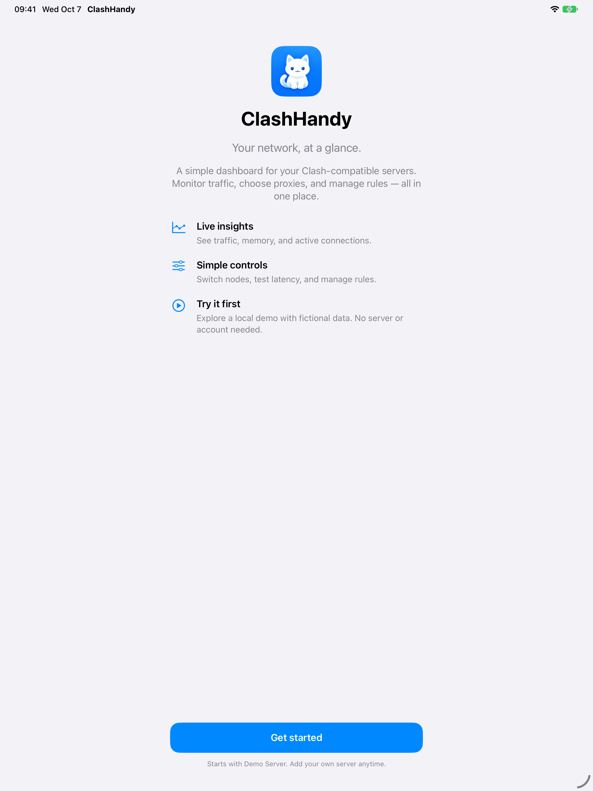
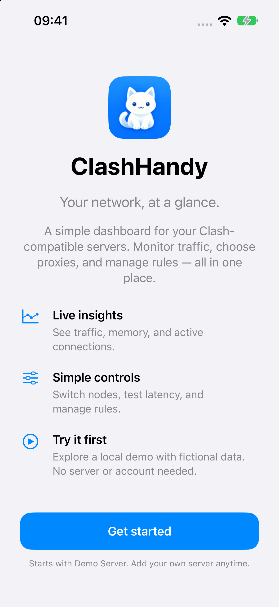
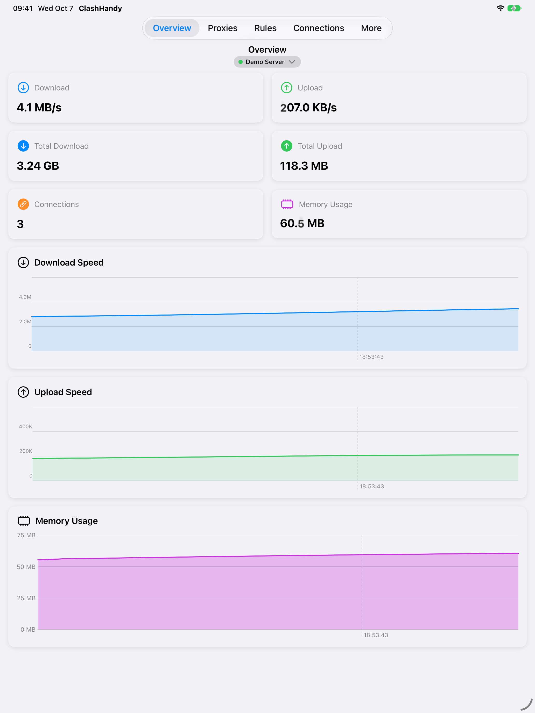

# ClashDash

ClashDash is an iOS dashboard for a Clash-compatible controller. Connect to a controller on your network to monitor traffic, inspect connections and rules, and manage proxy groups.

## Features

- Live download, upload, memory, and connection statistics with animated values and separate traffic charts.
- Proxy groups and providers, including provider-only nodes, with latency testing and selection.
- Rule and rule-provider lists.
- Connection details, logs, DNS lookup, and controller settings.
- A guided welcome screen with an offline demo server for exploring the dashboard before adding a controller.
- Multiple saved servers with connection status and a consistent selection indicator.
- Small and medium Home Screen widgets for download speed, upload speed, and active connections. Widgets refresh from the selected controller on the system's schedule and show the last update when it is unreachable.

## Screenshots

The welcome screen lets you explore a local demo without configuring a server. You can add your own Clash-compatible controller at any time.

| iPhone | iPad |
| --- | --- |
|  |  |
|  |  |

## Requirements

- Xcode 16 or later and an iPhone running iOS 17.6 or later.
- A reachable Clash-compatible controller with its external-controller address, port, and Secret.

## Run

1. Open `ClashDash.xcodeproj` in Xcode.
2. Select the `ClashDash` scheme and your iPhone as the destination.
3. Configure a development team for signing, then build and run.
4. Add a server in the server picker using the controller address, port, and Secret.

The app sends requests to the controller endpoints for proxies, proxy providers, rules, rule providers, version, and latency tests. It also uses WebSocket streams for live traffic, memory, connections, and logs.

## Home Screen widgets

After selecting a server in the app, add the small or medium Clash Dash widget from the Home Screen widget gallery. The widget requests traffic and connection data from that controller when iOS refreshes it. If the controller is unreachable, it shows the last saved readings with their age rather than displaying fabricated zeroes. Widget refresh timing is controlled by iOS, so it is not a continuous live monitor.

## Tests

Run the `ClashDash` scheme's tests in Xcode, or use:

```sh
xcodebuild -project ClashDash.xcodeproj -scheme ClashDash \
  -destination 'platform=iOS Simulator,name=iPhone Air' \
  CODE_SIGNING_ALLOWED=NO test
```

The API tests use mocked HTTP responses, so they do not require a live controller.

## Credits

Forked from [bin64/Clash-Dash](https://github.com/bin64/Clash-Dash). The App Icon is an original redraw for this fork, visually inspired by the cat motifs in [ClashX](https://github.com/ClashX-Pro/ClashX) and [Clash Verge Rev](https://github.com/clash-verge-rev/clash-verge-rev).
